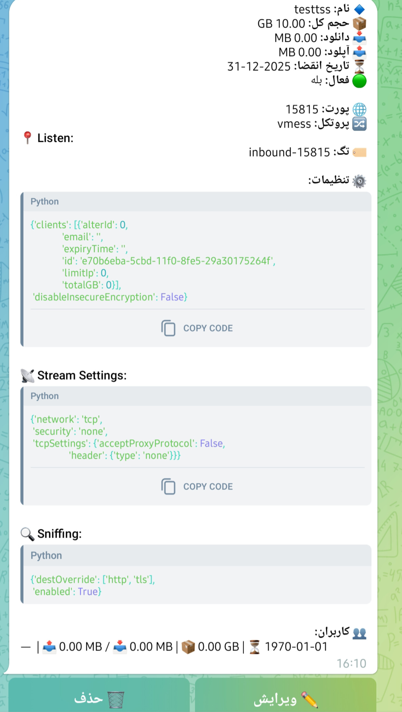
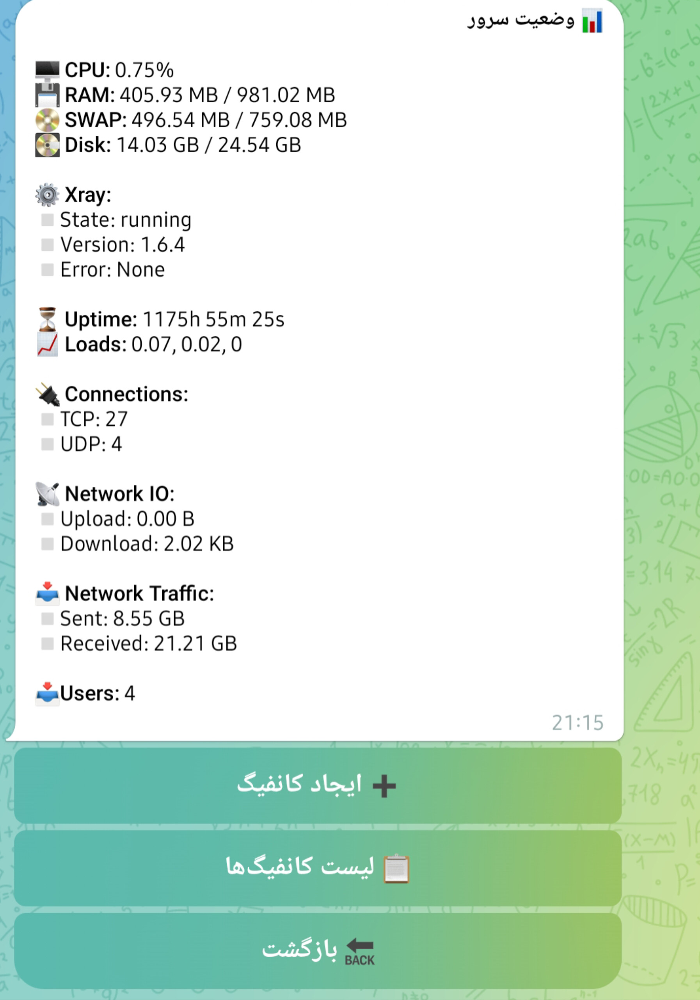

# X-UI Manager
A project based on the Telegram bot platform to manage the X-UI panel




# Install X-UI panel 

1. execute command on terminal

```bash
bash <(curl -Ls https://raw.githubusercontent.com/NidukaAkalanka/x-ui-english/master/install.sh)
```

2. setup username, password and port

# Start the robot

 1. edit source bot

> open main.py file and edit this lines
```python
api_id = ''
api_hash = ''
bot_token = ''
```

 2. execute command in terminal

**debian**
```bash
apt-get install python3 python3-pip git
```

**clone project**
```bash
git clone https://github.com/6-E-L-F-6/xui-manager
cd xui-manager
```
**Install the prerequisites.**
```bash
pip install -r requirements.txt
```
**lunch bot**
```bash
python3 main.py
```

**I would be happy to hear your comments or criticisms about my project. Also, if you are interested in collaborating on this project, please contact me. Telegram: [My Account](https://t.me/E6L6F6)**
